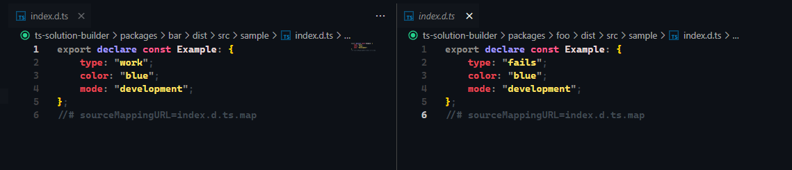
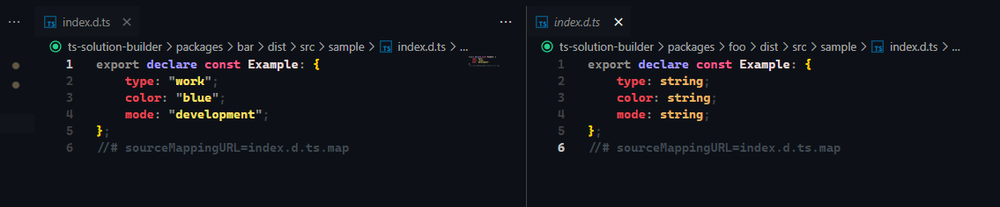

## Steps to play

The problem being reproduced in this repository is issuing d.ts files with read-only values!

A few points to consider like the monorepo, incremental build and path alias.

Using relative imports '../../' in the `bar` and `foo` packages the build works as expected, but if you set path alias in tsconfig and use these imports by the project it breaks.

## Functional build

```sh
yarn build
```

In this example we are building the packages individually
running `tsc` on each synchronously along with `tsc-alias -f` resolving the esm imports.

If you look at the screenshot you can see that both `d.ts` files are correct.


## Wrong build

```sh
yarn build:wrong
```

Now using incremental build (or even normal mode) `tsc -b`.

After the build if you look at `packages/bar/dist/src/sample/index.d.ts` and compare it to `packages/foo/dist/src/sample/index.d.ts` you will notice the following difference!

As can the values ​​were output correctly in the `bar` package, but in `foo` the values ​​defaulted to `string`.


You can even keep both files to notice changes live as you build!
The

## Third case

You can now try changing the `@/` alias imports to the normal `../` template that is commented out in the `packages/bar` files and run `build:wrong` again and you will see that now things work too.
